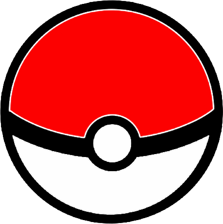

<h1 align="center">
   Gotta Catch 'Em All
</h1>

App que consome a PokeAPI e retorna um pokémon!

<h4 align="center"> 
	:heavy_check_mark:  Gotta Catch 'Em All :smile: Concluído :heavy_check_mark:
</h4>

Criei esse app usando vanilla JavaScript, CSS3 e HTML5.

O site está responsivo, é feito o consumo da <a href="https://pokeapi.co/" target="_blank">PokeAPI</a>, usando <a href="https://developer.mozilla.org/en-US/docs/Web/Guide/AJAX" target="_blank">AJAX</a>,
além disso, eu apliquei os conceitos de programação orientada a objetos.

 

O preview do site está em: <a href="https://wesley-nunes.github.io/gotta-catch-em-all/" target="_blank">Gotta Catch 'Em All</a>

